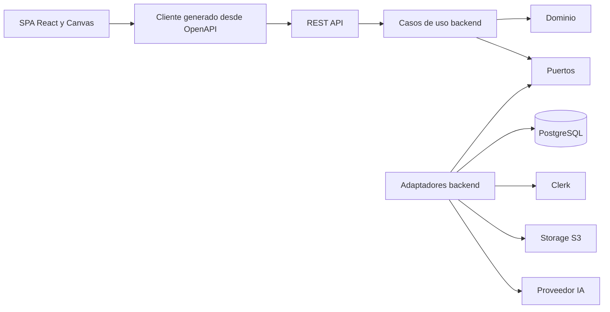
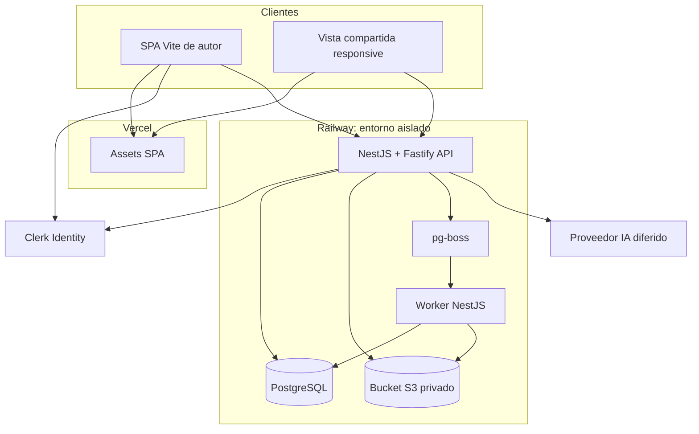
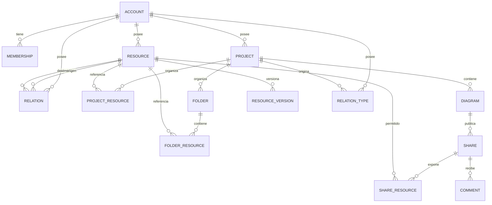

# Architecture Spine — Theke

## Paradigma de diseño

Frontend y backend se despliegan y versionan por separado. La SPA React consume únicamente contratos HTTP generados; el backend Node.js es un monolito modular con límites hexagonales. El dominio no conoce Clerk, PostgreSQL, almacenamiento, transporte de eventos ni proveedores de IA; los adaptadores implementan esos puertos.



## Invariantes y reglas

### AD-1 — Frontend y backend separados [ADOPTED]

- **Binds:** all
- **Prevents:** componentes acoplados a tablas, credenciales o SDKs de proveedor.
- **Rule:** La solución usa dos repositorios y despliegues independientes: `theke-web` —este repositorio— y `theke-api`. El backend se mantiene como monolito modular con límites hexagonales; no se divide en microservicios. La SPA depende del cliente generado desde OpenAPI y nunca accede directamente a PostgreSQL, Clerk administrativo, Storage ni proveedores de IA.

### AD-2 — Backend Node.js modular [ADOPTED]

- **Binds:** FR-1..FR-9, FR-19, FR-23, FR-32..FR-40; NFR-8..NFR-13
- **Prevents:** dos backends con autoridad y operación divergentes.
- **Rule:** `theke-api` usa Node.js 24 LTS, TypeScript, NestJS con `FastifyAdapter` y módulos por capacidad. Expone REST bajo `/v1`, OpenAPI versionado, SSE solo para notificaciones/invalidation y un proceso worker del mismo código desplegado por separado. No se introducen GraphQL, microservicios ni comandos por WebSocket en el MVP.

### AD-3 — Frontera de comandos server-side [ADOPTED]

- **Binds:** FR-2, FR-6..FR-8, FR-19, FR-23, FR-25..FR-40; NFR-7..NFR-18
- **Prevents:** mutaciones privilegiadas o multi-entidad desde el navegador.
- **Rule:** Toda lectura y mutación persistente pasa por `theke-api`; el navegador no posee credenciales ni conexión directa a PostgreSQL. Operaciones multi-entidad, destructivas, publicación, comentarios públicos, uploads e IA se ejecutan como casos de uso transaccionales del backend.

### AD-4 — Modelo canónico y documento de diagrama [ADOPTED]

- **Binds:** FR-3..FR-23, FR-32..FR-35; NFR-3, NFR-6, NFR-11
- **Prevents:** duplicar conocimiento por diagrama o mezclar contenido global con presentación local.
- **Rule:** Recursos y Relaciones son entidades canónicas normalizadas. Cada cambio de texto crea atómicamente una `ResourceVersion` inmutable con hash y ordinal, y actualiza `resource.current_version_id` mediante revisión esperada. Para archivos, una versión nace como candidata y solo actualiza `current_version_id` después de que los bytes promovidos estén `ready`; rechazo o fallo conserva la versión limpia anterior. Una Relación tiene dos extremos de Recurso, dirección, tipo, explicación, evidencia y procedencia. La Relación y su `RelationType` pertenecen a la Cuenta; el tipo registra `origin_project_id`, su catálogo se descubre inicialmente solo dentro de ese Proyecto y, una vez usado, se mantiene estable y solo se archiva. Carpetas y sus membresías pertenecen al Proyecto y solo se representan de forma compacta en el Canvas. Cada Diagrama persiste un documento JSONB versionado con Representaciones, Grupos, Anotaciones, presentación y visibilidad local, referenciando IDs canónicos; mostrar u ocultar una Relación en un Diagrama no altera la entidad canónica.

### AD-5 — Cuenta como tenant [ADOPTED]

- **Binds:** FR-1..FR-5, FR-9, FR-19..FR-23; NFR-6, NFR-9
- **Prevents:** propiedad ambigua y fugas entre cuentas.
- **Rule:** La cuenta/workspace en PostgreSQL es el tenant de seguridad. El webhook verificado de Clerk y el primer request autenticado comparten un `ensureLocalUser` idempotente para crear usuario local y cuenta personal sin depender del orden de llegada; `memberships` prepara colaboración futura. Recursos y Relaciones pertenecen a la cuenta; Proyectos seleccionan y organizan referencias. El `clerk_user_id` es identidad externa única, no clave primaria del dominio.

### AD-6 — Clerk autentica; Theke autoriza

- **Binds:** FR-32..FR-40; NFR-8..NFR-13
- **Prevents:** confundir autenticación externa con permisos de dominio, acceso entre cuentas o exposición de secretos.
- **Rule:** La SPA obtiene un session token corto de Clerk y lo envía como Bearer token. La API usa `@clerk/backend` con `CLERK_JWT_KEY`, `publishableKey`, `acceptsToken: 'session_token'` y `authorizedParties` por entorno; verifica localmente y falla cerrado ante clave, issuer, audience/origin, estado o expiración inválidos. La rotación de `jwtKey` es un cambio de secreto coordinado y probado antes de activarse. Webhooks de Clerk se verifican y procesan idempotentemente, pero nunca conceden permisos por sí solos. Cada request autenticado crea un `AuthContext`; las interfaces de repositorios tenant-owned exigen `accountId`, aplican scope en la consulta y usan FKs/uniques compuestas para impedir referencias cruzadas. `accountId` del cliente es selector, no autoridad; acceso global queda en adaptadores administrativos nominados. Las rutas públicas acceden únicamente a proyecciones seguras. Clerk gestiona identidad, sesiones y recuperación; Theke gestiona cuentas, roles y contenido.

### AD-7 — Guardado optimista con control de revisión [ADOPTED]

- **Binds:** FR-11, FR-19, FR-20; NFR-4..NFR-7
- **Prevents:** sobrescrituras silenciosas, doble aplicación y pérdida de trabajo local.
- **Rule:** El autoguardado envía el documento completo con debounce, `base_revision` e idempotency key; la actualización atómica incrementa `revision` o responde 409. Todo dato persistible se confirma primero al store/caso de uso; el estado interno de nodos solo puede ser buffer de edición. IndexedDB conserva un journal por `diagramId` y nunca reemplaza silenciosamente cambios locales.

### AD-8 — Separación de estado local y remoto [ADOPTED]

- **Binds:** FR-10..FR-23; NFR-1, NFR-3, NFR-4
- **Prevents:** dos autoridades de estado y mutaciones estructurales fuera del store.
- **Rule:** Zustand posee solo estado local/efímero del Canvas y TanStack Query la caché remota, con keys por tenant y `diagramId`. Al cambiar `diagramId`, hidratar, resetear y desuscribir es una transición atómica. Toda mutación estructural entra por comandos de `useCanvasStore` y se serializa mediante el repositorio de Diagrama. Canvas y Vista semántica derivan del mismo documento/store y ejecutan los mismos comandos. Se mantienen `container`, el orden padre-hijo, `expandParent`, controles `nodrag`/`nopan`, handles fuera de `overflow-hidden`, etiqueta `absolute top-full` y ausencia de `transition-all` en nodos redimensionables. Al reparentar se toma la posición absoluta actual, se convierte a coordenadas relativas al contenedor y se mueve el hijo después del padre.

### AD-9 — Compartido seguro y revocable [ADOPTED]

- **Binds:** FR-32..FR-35; NFR-10..NFR-12
- **Prevents:** tokens recuperables, publicación excesiva o acceso posterior a revocación.
- **Rule:** Solo puede existir un Compartido activo por Diagrama. Guarda únicamente el hash de un token aleatorio, una allowlist explícita de Recursos, `comments_enabled`, `current_projection_id` y su estado. Cada cambio guardado en el Diagrama o en una dependencia canónica expuesta —Recurso/versión, Relación, tipo o publicabilidad— invalida y reconstruye una proyección completa; solo una proyección válida se promueve atómicamente y el lector nunca mezcla revisiones. La allowlist nunca crece de forma implícita; se podan Representaciones no permitidas, Relaciones con extremos privados y metadatos privados. Una versión pendiente o no publicable conserva la última versión pública válida o muestra indisponibilidad segura. Revocar impide resoluciones nuevas; republicar crea otro Compartido, token e hilo y nunca reactiva el anterior. Los archivos permanecen privados y usan URLs firmadas de vida corta. `/s/:token` y `/v1/public/*` usan `no-referrer`, `private, no-store`, `noindex`, CSP restrictiva y excluyen el token de logs y telemetría.

### AD-10 — Identidad anónima y antiabuso [ADOPTED]

- **Binds:** FR-36..FR-40; NFR-10, NFR-13
- **Prevents:** edición de comentarios ajenos, abuso sin límites o pérdida del borrador por bloqueo.
- **Rule:** La identidad anónima usa un token opaco en cookie del dominio API `HttpOnly Secure; Path=/`, enviada con `credentials: include`, no renovable y válida 30 días. Producción usa `SameSite=Lax` bajo `app.*`/`api.*`; previews cross-site usan `SameSite=None` solo junto con CORS y `Origin` exactos, JSON obligatorio y token CSRF ligado a la sesión. El ownership persistido es un seudónimo HMAC de token + `shareId`, por lo que no enlaza Compartidos; al expirar se pierde la edición previa. Cada Comentario pertenece a un Compartido, no al conocimiento canónico; guarda ancla estable, última coordenada y snapshot mínimo, y puede estar activo, resuelto, eliminado o sin anclaje. Crear exige Compartido activo y comentarios abiertos; el visitante solo edita con su identidad y el autor solo resuelve o elimina, nunca reescribe texto ajeno. Los límites transaccionales se aplican por Compartido, sesión y huella IP con HMAC rotatoria, sin CAPTCHA inicial; el rechazo conserva el borrador. Los umbrales se fijan en historias y se ajustan con el piloto.

### AD-11 — Pipeline privado de uploads [ADOPTED]

- **Binds:** FR-6..FR-8, FR-12..FR-14, FR-32; NFR-8, NFR-12, NFR-16
- **Prevents:** publicación de archivos no inspeccionados y rutas controladas por el usuario.
- **Rule:** La API valida intención/cuota, crea `Resource` + `Upload` con IDs estables y una key de cuarentena única por `uploadId`, y entrega una URL PUT presignada de TTL corto con restricciones soportadas de tipo/checksum; el navegador carga directo al bucket privado. La URL se considera reutilizable hasta expirar. La máquina es `initiated -> uploaded -> scanning -> ready | rejected | failed`: finalize cierra lógicamente el upload y registra metadatos; el worker descarga un snapshot de cuarentena, verifica tamaño/MIME/hash, escanea esos mismos bytes y solo entonces los escribe en una key limpia nueva e inmutable derivada del hash. La `ResourceVersion` candidata referencia únicamente la key limpia y se promueve a `current_version_id` en la transición atómica a `ready`; jamás referencia cuarentena. Reintentos conservan `resourceId`, son idempotentes y limpian huérfanos. El Canvas admite placeholders no terminales. Un validador de publicabilidad bloquea multimedia sin alternativas accesibles. El nombre original es metadato, nunca ruta.

### AD-12 — Trabajo durable e idempotente [ADOPTED]

- **Binds:** FR-6..FR-8, FR-24..FR-31, FR-39; NFR-5, NFR-12, NFR-17
- **Prevents:** tareas largas bloqueando la API, jobs perdidos y efectos duplicados.
- **Rule:** `pg-boss` sobre la misma PostgreSQL es la autoridad única de jobs; dentro de la transacción Drizzle el caso de uso llama `boss.send(..., {db: fromDrizzle(tx, sql)})`. Cada envelope versionado contiene `jobId`, tipo, versión, deduplication key, payload referencial y `requestId`. El worker usa handlers idempotentes, retry con backoff y colas `<job>.dead` con retención, alerta, redrive idempotente y runbook comunes; payloads privados no aparecen en dashboards/logs. API y worker comparten módulos, pero se despliegan como procesos separados. No se introduce Redis, otra cola ni event sourcing.

### AD-13 — IA como puerto auditable [ADOPTED]

- **Binds:** FR-24..FR-31; NFR-5, NFR-14..NFR-18
- **Prevents:** dependencia directa de un proveedor, análisis implícito o cambios no confirmados.
- **Rule:** La IA es un puerto server-side opt-in. Cada ejecución persiste un manifiesto exacto de IDs y `ResourceVersion`, proveedor/modelo, finalidad, resultado, procedencia y versión de la política aceptada. Ningún proveedor puede usar contenido privado para entrenamiento sin consentimiento separado y explícito. Aceptar una sugerencia ejecuta los mismos comandos que la alternativa manual; proveedor y modelo permanecen diferidos y deben declarar retención y uso de datos antes de integrarse.

### AD-14 — SSE no es autoridad [ADOPTED]

- **Binds:** FR-11, FR-33, FR-39; NFR-4, NFR-6
- **Prevents:** convertir notificaciones en comandos o introducir coedición accidental.
- **Rule:** El navegador usa `fetch` streaming con `Authorization: Bearer`, nunca token en query string, y media type `text/event-stream`. Cada evento tiene `id`, `type`, `version`, `occurredAt` y payload referencial; heartbeat mantiene la conexión. Al refrescar el token se reconecta con `Last-Event-ID`; si el cursor expiró o existe un gap, la API responde una señal que obliga a refetch de TanStack Query. Polling periódico es fallback. SSE solo invalida/notifica; comentarios se mutan por REST, PostgreSQL es autoridad y no hay coedición. WebSocket queda diferido hasta requerir bidireccionalidad real.

### AD-15 — Despliegues y entornos aislados [ADOPTED]

- **Binds:** all
- **Prevents:** mezcla de datos o secretos entre entornos y previews contra producción.
- **Rule:** `theke-web` se despliega en Vercel; API, worker, PostgreSQL y bucket privado se despliegan inicialmente en Railway. Producción coloca API/worker, DB y bucket en una región elegida por medición desde Chile; `app.*` y `api.*` usan TLS, CORS/Origin exactos y Clerk `authorizedParties` del entorno. Frontend-only PR usa API staging con datos de prueba; backend-only PR usa Railway PR Environment aislado y pruebas de contrato; un preview full-stack requiere `previewId` compartido y automatización CI que inyecta en Vercel la URL Railway, origins, cookie preview y digest contractual emparejados. No se afirma aislamiento full-stack sin ese emparejamiento. Un único migration job con advisory lock ejecuta expand antes de API/worker; ambos conservan compatibilidad N/N-1, pasan health checks y contract corre solo tras retirar código anterior.

### AD-16 — Esquema y contratos versionados [ADOPTED]

- **Binds:** all
- **Prevents:** drift de esquema, DTOs incompatibles y cambios manuales no reproducibles.
- **Rule:** Drizzle schema y migraciones SQL viven solo en `theke-api`; producción nunca usa `push`. `theke-api` contiene `packages/contracts`, fuente canónica de OpenAPI, JSON Schema del Canvas, migraciones puras del documento, fixtures y envelopes SSE. CI publica `@theke/contracts` como paquete npm inmutable SemVer con digest; backend y web fijan exactamente esa versión en lockfile, y Orval genera el cliente desde el `openapi.json` del paquete, nunca desde `latest` ni una URL mutable. API verifica compatibilidad con la versión desplegada y la candidata, soporta al menos actual + anterior y no retira campos hasta confirmar adopción. La copia de esta spine vive canónicamente aquí hasta crear `theke-api`; ambos repos validan el mismo digest/versión mediante un manifest de arquitectura. Cambios de DB/API/eventos son aditivos y siguen expand/migrate/contract; tipos DB, dominio y API permanecen separados.

### AD-17 — Observabilidad sin contenido privado [ADOPTED]

- **Binds:** NFR-2, NFR-4, NFR-5, NFR-10, NFR-13
- **Prevents:** incidentes sin trazabilidad y filtración de contenido en telemetría.
- **Rule:** Web, API y worker reportan a Sentry con SDKs React y Node alineados. API/worker emiten logs JSON y trazas correlacionadas por `requestId`/`jobId`, sin contenido de Recursos. Se miden autoguardado, latencia pública, errores, cola e IA; los eventos del piloto son first-party.

### AD-18 — Gate de verificación [ADOPTED]

- **Binds:** all
- **Prevents:** aceptar cambios sin validar dominio, autorización, accesibilidad o recorridos críticos.
- **Rule:** Vitest cubre dominio, aplicación y adaptadores; Testing Library cubre UI; integración del backend usa PostgreSQL real aislada y prueba la matriz tenant/roles y transacciones. Playwright cubre UJ-1/UJ-2, autoría desktop con teclado y vista compartida móvil/táctil con reflow a 320 CSS px. OpenAPI generado/cliente, jobs y el escenario de 200 Representaciones/300 Relaciones también se verifican. CI de ambos repos exige lint, build y suites relevantes; el MVP no incluye autoría móvil completa ni app nativa.

### AD-19 — Recuperación antes del piloto [ADOPTED]

- **Binds:** NFR-4, NFR-6, NFR-8
- **Prevents:** asumir que el backup de PostgreSQL recupera objetos del bucket.
- **Rule:** Antes del piloto externo existe un plan con backups diarios de PostgreSQL, exportación verificada y copia periódica de objetos fuera del bucket principal. RPO, RTO y frecuencia se aprueban antes del piloto y un restore drill restaura DB + objetos y valida referencias cruzadas.

### AD-20 — Documento de Canvas validado [ADOPTED]

- **Binds:** FR-10..FR-23; NFR-3..NFR-7
- **Prevents:** documentos imposibles de hidratar, contenido canónico duplicado y jerarquías que rompen React Flow.
- **Rule:** El documento usa la unión discriminada y migraciones versionadas publicadas por `@theke/contracts`; guarda IDs canónicos más presentación local, no copias de Recursos. Backend, web e IndexedDB validan contra el mismo schema/digest y ejecutan las mismas fixtures de compatibilidad. Toda lectura valida y migra versiones, rechaza IDs/tipos inválidos y ciclos de parentado, y normaliza padres antes que hijos sin alterar coordenadas.

### AD-21 — Fetch externo contenido [ADOPTED]

- **Binds:** FR-8; NFR-8, NFR-12
- **Prevents:** SSRF, descargas ilimitadas y metadatos activos o maliciosos.
- **Rule:** Todo preview de URL se obtiene server-side por un adaptador que acepta solo HTTP(S), resuelve y bloquea redes privadas, loopback y metadata cloud en cada redirección, limita redirecciones, bytes y tiempo, y sanea el metadato resultante. Un fallo de preview no impide guardar el enlace.

### AD-22 — Ciclo de vida y gobierno [ADOPTED]

- **Binds:** FR-2, FR-10, FR-23; NFR-6, NFR-8, NFR-9
- **Prevents:** borrados irreversibles ambiguos y retenciones incompatibles entre módulos.
- **Rule:** Archivar usa `archived_at` y es reversible. El borrado definitivo es un comando server-side que presenta impacto, respeta referencias y aplica una política única de retención; exportación, borrado de cuenta y plazos de retención son gates documentados antes de producción.

### AD-23 — Consultas progresivas [ADOPTED]

- **Binds:** FR-3..FR-9, FR-15; NFR-3
- **Prevents:** materializar bibliotecas, carpetas o multimedia completas en cliente.
- **Rule:** Biblioteca, Carpetas y búsquedas usan paginación por cursor estable; una Representación de Carpeta carga resumen y conteos, no todos sus Recursos. Previews y contenido multimedia se cargan bajo demanda.

## Convenciones de consistencia

| Concern | Convention |
| --- | --- |
| Identificadores | UUID v4 opacos. |
| Tiempo | `timestamptz` en UTC; DTOs en ISO-8601. |
| Nombres | `snake_case` en DB; `camelCase` en DTO/UI. |
| Respuesta API | Éxito `{data,meta?}`; error `{error:{code,message,details?,requestId}}`. |
| Autorización | Clerk verifica identidad; permisos y tenant se resuelven siempre en PostgreSQL. |
| Mutación | Comandos explícitos; idempotency keys; transacción Drizzle + enqueue `pg-boss`. |
| Logging | JSON con `requestId`; nunca contenido de Recursos ni secretos. |
| API del navegador | REST `/v1` en `api.*`; Bearer Clerk; OpenAPI genera el cliente web. |

## Stack

| Name | Version | Estado |
| --- | --- | --- |
| React | 19.2.8 | Existente |
| TypeScript | 6.0.3 | Existente, lockfile |
| Vite | 8.2.2 | Existente, lockfile |
| React Router DOM | 7.18.2 | Existente |
| React Flow (`@xyflow/react`) | 12.11.3 | Existente |
| Zustand | 5.0.15 | Existente |
| Tailwind CSS | 4.3.3 | Existente |
| TanStack Query | 5.103.1 | Planificado |
| Clerk React | 5.61.3 | Planificado |
| Node.js | 24.21.0 LTS | Requerido en web/backend; web local debe subir desde 22.15.0 |
| NestJS Core / Fastify adapter | 12.0.4 | Backend planificado |
| Fastify | 5.12.5 | Backend planificado |
| NestJS Swagger | 12.0.1 | Backend planificado |
| class-validator | 0.15.1 | Backend planificado |
| class-transformer | 0.5.1 | Backend planificado |
| Clerk Backend | 3.18.1 | Backend planificado |
| Drizzle ORM / Kit | 0.45.3 / 0.31.11 | Backend planificado |
| node-postgres (`pg`) | 8.23.0 | Backend planificado |
| pg-boss | 12.33.3 | Backend planificado |
| AWS SDK S3 / presigner | 3.1136.0 | Backend planificado |
| Orval | 8.35.0 | Generación de cliente planificada |
| Sentry React | 10.75.0 | Planificado |
| Sentry Node | 10.75.0 | Backend planificado |
| Vitest | 5.0.1 | Planificado |
| Testing Library React | 16.3.3 | Planificado |
| Testing Library DOM | 10.4.2 | Planificado |
| Playwright | 1.63.0 | Planificado |

## Semilla estructural





```text
theke-web/                 # repositorio actual
  src/
    app/                 # composición, rutas y providers
    features/            # superficies por capacidad, incluido canvas
    api/generated/       # cliente creado desde openapi.json
    data/                # query keys y adaptadores del cliente
    store/               # estado local/efímero del Canvas
  tests/
    e2e/                 # UJ-1 y UJ-2

theke-api/                 # repositorio backend separado
  packages/
    contracts/            # OpenAPI, Canvas schema/migrations, SSE; publica @theke/contracts
  src/
    modules/              # account, projects, resources, canvas, sharing, AI
    domain/               # entidades, reglas y puertos
    application/          # casos de uso y comandos
    infrastructure/       # PostgreSQL, Clerk, S3, pg-boss, IA
    interfaces/http/      # REST, OpenAPI, SSE y webhooks
    worker/               # bootstrap y handlers de jobs
  drizzle/                # migraciones SQL versionadas
  tests/                  # unit, integration, authorization
```

## Mapa de capacidades a arquitectura

| Capability / Area | Lives in | Governed by |
| --- | --- | --- |
| FR-1 — Cuenta | Clerk, `features/account`, módulo account backend | AD-2, AD-5, AD-6 |
| FR-2..FR-5 — Proyectos, Biblioteca y Carpetas | módulos `projects`/`library`, Postgres | AD-3..AD-6, AD-16, AD-22, AD-23 |
| FR-6..FR-9 — Recursos, archivos y reutilización | `resources`, Storage, pipeline de jobs | AD-3..AD-6, AD-11, AD-12, AD-21, AD-23 |
| FR-10..FR-18 — Diagrama y edición visual | `features/canvas`, `useCanvasStore`, repositorio de Diagrama | AD-4, AD-7, AD-8, AD-20 |
| FR-19..FR-23 — Recursos y Relaciones canónicos | dominio, casos de uso, Postgres | AD-3..AD-8, AD-16, AD-20, AD-22 |
| FR-24..FR-31 — Asistencia de IA | puerto IA, API y adaptador de proveedor | AD-3, AD-12, AD-13, AD-17 |
| FR-32..FR-35 — Publicación | `sharing`, API pública, proyección y URLs firmadas | AD-3, AD-6, AD-9, AD-11 |
| FR-36..FR-40 — Comentarios | `comments`, identidad anónima, REST + SSE | AD-3, AD-6, AD-9, AD-10, AD-14 |
| NFR-1..NFR-3 — Rendimiento | Canvas, carga progresiva, vista pública | AD-7, AD-8, AD-18, AD-23 |
| NFR-4..NFR-7 — Fiabilidad e integridad | revisiones, IndexedDB, comandos y recuperación | AD-4, AD-7, AD-12, AD-19, AD-20, AD-22 |
| NFR-8..NFR-13 — Seguridad y privacidad | Clerk, autorización backend, Storage, antiabuso | AD-5, AD-6, AD-9..AD-12, AD-21, AD-22 |
| NFR-14..NFR-18 — IA responsable | puerto IA y registro de ejecuciones | AD-13, AD-17 |
| NFR-19..NFR-22 — Accesibilidad y compatibilidad | UI, Canvas y vista compartida | DESIGN/EXPERIENCE, AD-8, AD-18 |

## Deferred

- Proveedor y modelo de IA: elegir antes de implementar FR-25..FR-31.
- Motor de escaneo de malware: elegir antes de habilitar exposición pública de uploads.
- Proveedor de backup externo: elegir antes del piloto público.
- Límites concretos de tamaño, duración, formatos y cuota: fijar en historias de carga.
- Umbrales concretos de antiabuso: fijar en historias de comentarios y ajustar con datos del piloto.
- Canales de notificación adicionales: el MVP solo fija bandeja interna.
- Reglas de edad y consentimiento: requieren revisión de Producto/legal antes del lanzamiento público.
- Métodos iniciales de acceso en Clerk: recomiendo email con código + Google; confirmar antes de implementar Cuenta.
- Clerk Organizations: no usar en el MVP; evaluar solo cuando exista colaboración real entre miembros.
- Política detallada de exportación, borrado definitivo y retención: aprobar antes de producción.

## Decisiones confirmadas

Confirmadas por el usuario el 2026-09-21:

1. Dos repositorios: `theke-web` y `theke-api`; backend modular, no microservicios.
2. NestJS + Fastify + Node.js para API/worker, con REST/OpenAPI y SSE.
3. Clerk para autenticación, pero cuentas, membresías y autorización propias en PostgreSQL.
4. Railway inicial para API, worker, PostgreSQL y bucket privado; Vercel para la SPA.
5. PostgreSQL + Drizzle + pg-boss; no Redis ni segunda cola en el MVP.
6. Vigencia de 30 días para la cookie de identidad anónima.
7. Documento JSONB versionado por Diagrama para la composición local.
8. Estrategia antiabuso sin CAPTCHA inicial y sus límites por Compartido, sesión e IP HMAC.
9. Autoguardado por documento completo con revisión optimista, en lugar de operaciones incrementales.
